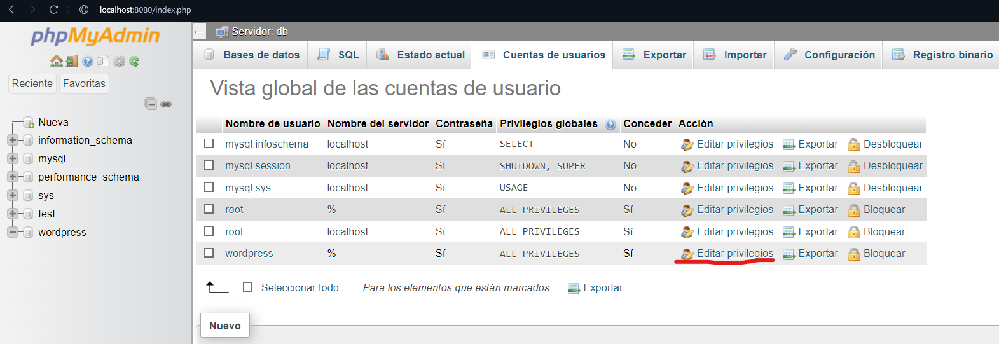
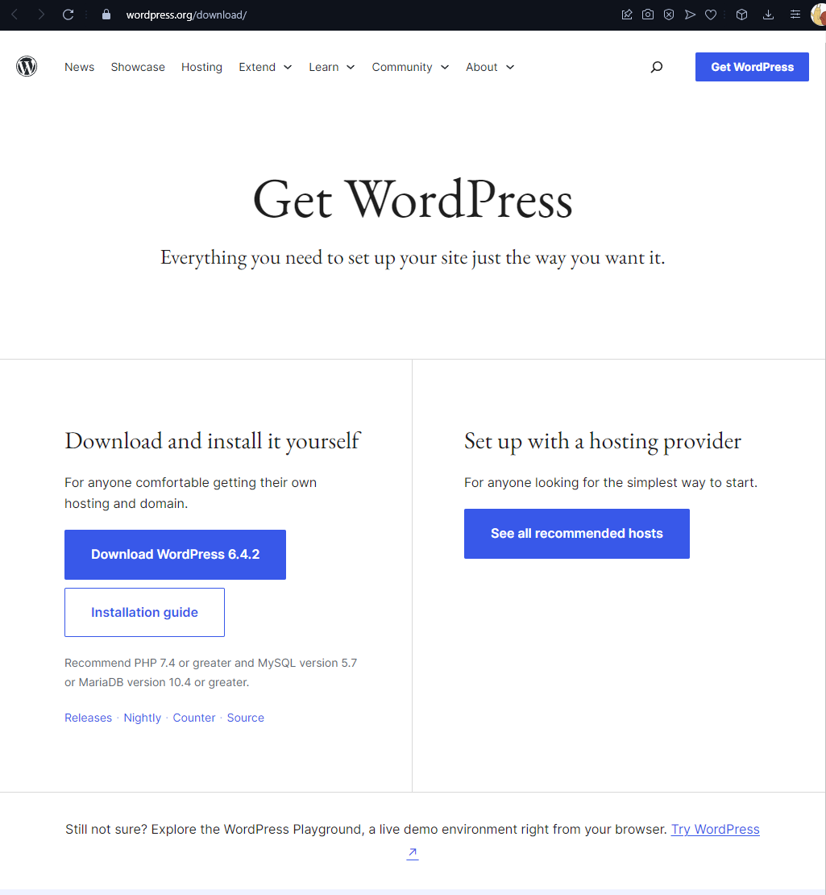
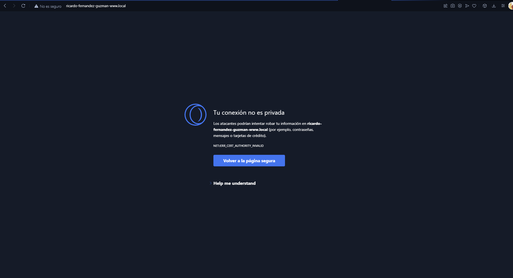
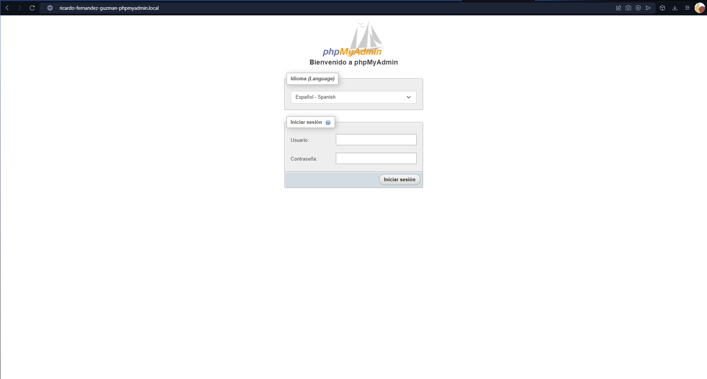

# Configuración de la Pila LAMP en Docker

## Índice

1. [Requisitos Previos](#requisitos-previos)
2. [Estructura del Proyecto](#estructura-del-proyecto)
3. [PARTE 1: Configuración de Virtual Host](#parte-1-configuración-de-virtual-host)
    1. [Modificación de Nombres de VirtualHost](#1-modificación-de-nombres-de-virtualhost)
        - [1.1. Acceder al Archivo de Hosts](#11-acceder-al-archivo-de-hosts)
        - [1.2. Editar el Archivo de Hosts](#12-editar-el-archivo-de-hosts)
        - [1.3. Acceder al Archivo de Configuración de Apache](#13-acceder-al-archivo-de-configuración-de-apache)
        - [1.4. Editar el Archivo de Configuración](#14-editar-el-archivo-de-configuración)
        - [1.5. Reiniciar Docker-Compose y comprobación](#15-reiniciar-docker-compose-y-comprobación)
    2. [Creación de Virtual Host para PhpMyAdmin](#2-creación-de-virtual-host-para-phpmyadmin)
    3. [Modificación del Index.html de Intranet](#3-modificación-del-indexhtml-de-intranet)
    4. [Añadir Nuevo Usuario](#4-añadir-nuevo-usuario)
    5. [Instalación de CMS Wordpress](#5-instalación-de-cms-wordpress)
4. [PARTE 2: Instalación de Certificados SSL](#parte-2-instalación-de-certificados-ssl)
    1. [Generación de Certificados](#1-generación-de-certificados)
        - [2.1.1. Crear Directorio de Certificados](#11-crear-directorio-de-certificados)
        - [2.1.2. Lanzar el Comando de Generación de Certificados](#12-lanzar-el-comando-de-generación-de-certificados)
    2. [Configurar Virtual Host 443](#2-configurar-virtual-host-443)
    3. [Habilitar Módulo mod_ssl](#3-habilitar-módulo-mod_ssl)
    4. [Evidencias de ejecución](#4-evidencias-de-ejecución)

## Requisitos Previos

Antes de comenzar con este procedimiento, partimos de haber completado correctamente los pasos para el despliegue del servidor web Apache cedido por el profesor. Puedes encontrar las instrucciones detalladas para hacerlo en el archivo readme.md del repositorio [docker-lamp](https://github.com/antonio-gabriel-gonzalez-casado/docker-lamp/).

## Estructura del proyecto
La estructura del proyecto finalizado es la siguiente:
```
docker-lamp-despliegue
├─ .gitignore 
├─ LICENSE
├─ README.md
├─ apache2-php
│  ├─ certs
│  │  ├─ intranet.crt
│  │  ├─ intranet.key
│  │  ├─ phpmyadmin.crt
│  │  ├─ phpmyadmin.key
│  │  ├─ www.crt
│  │  └─ www.key
│  ├─ Dockerfile
│  ├─ conf
│  │  ├─ 000-default.conf
│  │  ├─ intranet.conf
│  │  └─ ricardo-fernandez-guzman-phpmyadmin.conf
│  ├─ etc
│  │  └─ apache2
│  │     └─ .htpasswd
│  └─ www
│     ├─ index.html
│     ├─ intranet
│     │  └─ index.html
│     ├─ phpinfo.php
│     ├─ test-bd.php
│     └─ wordpress
│        └─ carpetas del entorno...
├─ dist
│  ├─ env.dist
│  └─ htpasswd.dist
├─ docker-compose.yml
├─ docs
│  └─ images
└─ mysql
   ├─ conf
   └─ dump
      └─ myDb.sql

```

## PARTE 1: Configuración de Virtual Host

### 1. Modificación de Nombres de VirtualHost

Modifica los nombres de los VirtualHost dados de ejemplo:

- www.local -> ricardo-fernandez-guzman-www.local
- intranet.local -> ricardo-fernandez-guzman-intranet.local

#### 1.1. Acceder al Archivo de Hosts

Abrir el archivo de hosts en el sistema. Este archivo generalmente se encuentra en:

- **Windows:** C:\Windows\System32\drivers\etc\hosts
- **Linux/Mac:** /etc/hosts

En mi caso estoy usando windows por lo que se llegaría a esta carpeta:


#### 1.2. Editar el Archivo de Hosts

Se añaden las siguientes líneas al final del archivo, para ello se accede con un editor de texto, por ejemplo el bloc de notas:

```
127.0.0.1    ricardo-fernandez-guzman-www.local
127.0.0.1    ricardo-fernandez-guzman-intranet.local
```


Se guarda y se cierra el archivo.

#### 1.3. Acceder al Archivo de Configuración de Apache

Nos dirigimos al archivo de configuración de nuestras páginas del servidor web Apache en nuestro proyecto Docker. Para nuestra estructura de archivos seria en:

- **apache2-php/conf/000-default.conf:** para ricardo-fernandez-guzman-www.local
- **apache2-php/conf/intranet.conf:** para ricardo-fernandez-guzman-intranet.local


#### 1.4. Editar el Archivo de Configuración

En los archivos de configuración se buscan las líneas relacionadas con los VirtualHost y se modifican los ServerName para reflejar tus nuevos nombres.

##### Para ricardo-fernandez-guzman-www.local

```
<VirtualHost *:80>
    ServerName ricardo-fernandez-guzman-www.local
    DocumentRoot /var/www/html

    <Directory /var/www/html>
        AllowOverride All
        Require all granted
    </Directory>
</VirtualHost>
```
##### Para ricardo-fernandez-guzman-intranet.local
```
Listen 8060

<VirtualHost *:8060>
    ServerName ricardo-fernandez-guzman-intranet.local
    DocumentRoot /var/www/html/intranet

    <Directory /var/www/html/intranet>
        Options Indexes FollowSymLinks
        AllowOverride All

        AuthType Basic
        AuthName "Area Restringida"
        AuthUserFile /etc/apache2/.htpasswd
        Require valid-user
    </Directory>
</VirtualHost>
```

#### 1.5. Reiniciar Docker-Compose y comprobación
Se reinicia docker-compose para aplicar los cambios:
```
docker-compose restart
```
A continuación ya se deberia de poder acceder utilizando las siguientes URLs

http://ricardo-fernandez-guzman-www.local


http://ricardo-fernandez-guzman-intranet.local:8060

Para este caso, debido a la configuración que hemos establecido, es necesario loguearse con un usuario y contraseña válidos. Estos serían los dispuestos en el archivo htpasswd.dist. Los cuales siguen la estructura **usuario:contraseña-cifrada**.

En este caso hemos entrado con el usuario configurado por defecto que seria usuario1 y contraseña 123456789.


Una vez verificadas las credenciales podremos acceder a la página de esta URL


### 2. Creación de Virtual Host para PhpMyAdmin
Lo primero que tenemos que hacer es crear un nuevo archivo de configuración del virtual host que se llame ricardo-fernandez-guzman(el ejercicio pide nombre-apellidos)-phpmyadmin.local:8081.

La estructura de nuestro archivo de configuración es muy similar a la de nuestro archivo de configuración de intranet con la diferencia de que en vez de utilizar la etiquea *"directory"* se utiliza *"location"* ya que se va a configurar un proxy inverso para redirigir.
```
Listen 8081

<VirtualHost *:8081>
    ServerName ricardo-fernandez-guzman-phpmyadmin.local

    <Location />
        Options Indexes FollowSymLinks
        AllowOverride All

        AuthType Basic
        AuthName "Area Restringida"
        AuthUserFile /etc/apache2/.htpasswd
        Require valid-user
    </Location>

    ProxyPreserveHost On
    ProxyPass / http://phpmyadmin:80/
    ProxyPassReverse / http://phpmyadmin:80/
</VirtualHost>
```
Con esto lo que se consigue es que para ricardo-fernandez-guzman-phpmyadmin.local te mande a la página de phpMyAdmin


### 3. Modificación del Index.html de Intranet
Para ello hay que modificar el archivo que se encuentra en [apache2-php/www/intranet/index.html](apache2-php/www/intranet/index.html) y cambiarlo como uno prefiera. En mi caso, ahora la página principal para intranet es la siguiente:


### 4. Añadir Nuevo Usuario

Nos piden añadir un nuevo usuario que cuente con la estructura nombre-apellidos a la lista de usuarios que pueden acceder a intranet. Para ello modificaremos el archivo donde se guardan los usuarios y contraseñas([aqui](apache2-php/etc/apache2/.htpasswd)).

Como mencioné antes los usuarios siguen la estructura de usuario-contraseña-cifrada, para realizar esto manera sencilla se ha empleado la página web [hellotools](https://hellotools.org/es/generar-cifrar-contrasena-para-archivo-htpasswd).

No se me ha permitido utilizar guiones en el usuario por lo que se ha optado por la estructura de nombres y apellidos toda junta.


El usuario con la contraseña cifrada sería tal que así:
```
ricardofernandezguzman:$2y$10$PBhaC1jM.yG8Ty7g4fQYaellCkJvg2BeTxhokNGADvv5v8/bJhn4m
```
Para que se apliquen todos estos cambios habría que resetear apache, aunque a mi por algún motivo con eso no me ha funcionado y he tenido que volver a buildear el docker-compose con el comando 
```
docker-compose build
```


A continuación se puede entrar en intranet con el nuevo usuario con su respectiva contraseña:


### 5. Instalación de CMS Wordpress
Lo primero es acceder al menú de phpMyAdmin utilizando el usuario y contraseña configurados. Al hacerlo entraremos en una ventana similar a la siguiente. El primer paso será ir a la sección para ver todas las bases de datos, se encuentra en el header superior.


Crearemos una base de datos que será la que utilizaremos para el WordPress, yo no me he comido mucho la cabeza y la he llamado WordPress


Lo siguiente es crear a un usuario, para ello nos vamos al menú principal de phpMyAdmin en la sección de Cuentas de usuarios


Aparecen todos los usuarios que ya tenemos, pero como lo que vamos a hacer es uno nuevo le damos al enlace que está debajo de estos usuarios que dice "Agregar cuenta de usuario"


En este formulario es obligatorio rellenar el nombre, que le hemos puesto wordPress y una contraseña recomendable segura y activar el tick para otorgarle todos los privilegios


Volvemos a la ventana con todos los usuarios y ahora vemos que aparece nuestro usuario "wordpress" y vamos a editar los privilegios de este usuario



Le damos en la parte superior en donde pone "Base de datos" porque vamos a configurar los permisos de este usuario en la base de datos wordpress


 A continuación nos aparecerá un menu para asignarle permisos sobre esa base de datos, similar como parece en la configuración de permisos global. Le asignamos todos los permisos dandole al tick que nos permite esta opción.
 Esto sería todo lo que hay que configurar en el phpMyAdmin.

 En nuestro proyecto, lo primero sería descargar WordPress, se puede hacer desde la página Oficial de [WordPress](https://es.wordpress.org/download/)



Una vez hecho, guardaremos la carpeta de WordPress en ```apache2-php/www``` .Quedaría de la siguiente forma:


Dentro de esta carpeta hay que modificar el archivo ```wp-config.php``` y asignarles los valores de nuestra base de datos creada en phpMyAdmin en este archivo de configuración; nombre de la base de datos, usuario, contraseña y el host. Este último se puede encontrar en la parte superior de phpMyAdmin.


Mi configuración es esta:


En principio ya tenemos todo configurado, para que se actualice todas estas configuraciones realizamos un reset a nuestro docker compose ```docker-compose restart```

Una vez hecho esto, para proceder a la instalación de WordPress, utilizamos una URL con la estructura:
http://example.com/wp-admin/install.php

En mi caso además hay que añadirle la ruta ```/wordpress``` antes de ```/wp-admin``` ya que de normal estamos ubicados en la carpeta ```/www```. Mi URL para acceder a la instalación de WordPress sería:
http://ricardo-fernandez-guzman-intranet.local/wordpress/wp-admin/install.php

Ya solo queda configurar con la información que se quiera el título, así como el usuario y la contraseña, que ya viene generada de base una segura, además del email. Guardamos en un bloc de notas aparte el usuario y la contraseña para no perderlos. Una vez rellenado este formulario le damos al botón de instalar WordPress.


Al acabar podremos logearnos con el usuario y la contraseña definidos anteriormente


## PARTE 2: Instalación de Certificados SSL

### 1. Generación de Certificados

#### 1.1 Crear Directorio de Certificados
Para empezar, se va a crear una un directorio dentro de apache2-php. Abro un terminal desde apache2-php y creo una carpeta mediante comando y seguidamente nos metemos en esta carpeta que es donde se van a crear los certificados
```
mkdir certs
cd certs
```

#### 1.2 Lanzar el Comando de Generación de Certificados

El comando para la generación de certificados tiene la siguiente estructura:
```
openssl req -x509 -nodes -days 365 -newkey rsa:2048 -keyout nombre-certificado.key -out nombre-certificado.crt
```

Para local se van a llamar www y para intranet se van a llamar intranet, quedando los comandos como:
```
openssl req -x509 -nodes -days 365 -newkey rsa:2048 -keyout www.key -out www.crt
openssl req -x509 -nodes -days 365 -newkey rsa:2048 -keyout intranet.key -out intranet.crt
```

Al ejecutar cada uno de los comandos muestra un pequeño formulario que nos pedira información tal como el pais, estado, organización, correo, entre otras.
Lo que si que es importante es que en el apartado de Common Name se introduzca el nombre del domino, es decir, www.local e intranet.local

En la siguiente imagen muestra la ejecución del comando de creación de certificado, en este caso para crear el certificado de intranet.local


Adicionalmente se pide realizar el certificado HTTPS para el virtual Host de phpMyAdmin(**ricardo-fernandez-guzman-phpmyadmin.local**)
Mis certificados para este virtual host se llamaran phpmyadmin.crt y phpmyadmin.key y se pueden crear con el siguiente comando y presentará una pantalla similar a la de la creación de los anterirores certificados:
```
openssl req -x509 -nodes -days 365 -newkey rsa:2048 -keyout phpmyadmin.key -out phpmyadmin.crt
```

Para organizar un poco esto, la estructura de mi carpetas de certificados sería la siguiente:


### 2. Configurar para el protocolo HTTPS
A continuación, para cada archivo de configuración añadimos una regla nueva justo después de la etiqueta *Directory* para que se verifique se usa el certificado y permita direcciones HTTPS

[**Para ricardo-fernandez-guzman-www.local**](apache2-php/conf/00-default.conf)
```
SSLEngine on
SSLCertificateFile /etc/apache2/ssl/www.crt
SSLCertificateKeyFile /etc/apache2/ssl/www.key
```

[**Para ricardo-fernandez-guzman-intranet.local**](apache2-php/conf/intranet.conf)
```
SSLEngine on
SSLCertificateFile /etc/apache2/ssl/intranet.crt
SSLCertificateKeyFile /etc/apache2/ssl/intranet.key
```

[**Para ricardo-fernandez-guzman-phpmyadmin.local**](apache2-php/conf/ricardo-fernandez-guzman-phpmyadmin.conf)
```
SSLEngine on
SSLCertificateFile /etc/apache2/ssl/phpmyadmin.crt
SSLCertificateKeyFile /etc/apache2/ssl/phpmyadmin.key
```

### 3. Habilitar Módulo mod_ssl
Primero debemos añadir un par de lineas al DockerFile, la primera una para que lleve los certificados a /etc/apache/ssl
```
COPY ./certs /etc/apache2/ssl
```

La siguiente linea la añadiremos después de la anterior y será la que nos habilitará el módulo ssl:
```
RUN a2enmod ssl
```

El DockerFile ya estaria completamente configurado y podría de verse su estructura completa en el siguiente [enlace](apache2-php/Dockerfile).

### 4. Evidencias de ejecución

**Evidencias de ejecución HTTPS para ricardo-fernandez-guzman-www.local**
De esta forma, si ahora intentamos entrar en la página mediante protocolo seguro HTTPS, nos aparecerá un mensaje de advertencia diciendo que la conexión no es segura. Esto es correcto ya que los certificados los hemos realizado nosotros mismos.



Para acceder a la página entramos en el enlace "Help me understand" y le damos a que queremos ir a ese enlace:


**Evidencias de ejecución HTTPS para ricardo-fernandez-guzman-intranet.local**
Al igual que como ocurre en el caso anterior nos saldrá el mismo mensaje de advertencia que en el caso anterior. Se realiza el mismo proceso.


La diferencia con respecto al anterior y es que, como lo tenemos configurado, claramente nos va a pedir la verificación de usuario válido. La realizamos con el usuario que se configuró en pasos anteriores y podremos acceder a la página


**Evidencias de ejecución HTTPS para ricardo-fernandez-guzman-phpmyadmin.local**
Por último pero no menos importante, probamos la url con el protocolo seguro para el virtual host de phpMyAdmin, y, se tiene configurado bien ocurrire como en los dos anteriores casos y se obtendrá la ventana de advertencia y al hacerlos, tal y como lo hemos configurado se accederá a la página principal de phpMyAdmin, una vez que se haya validado el usuario que intenta ingresar.



